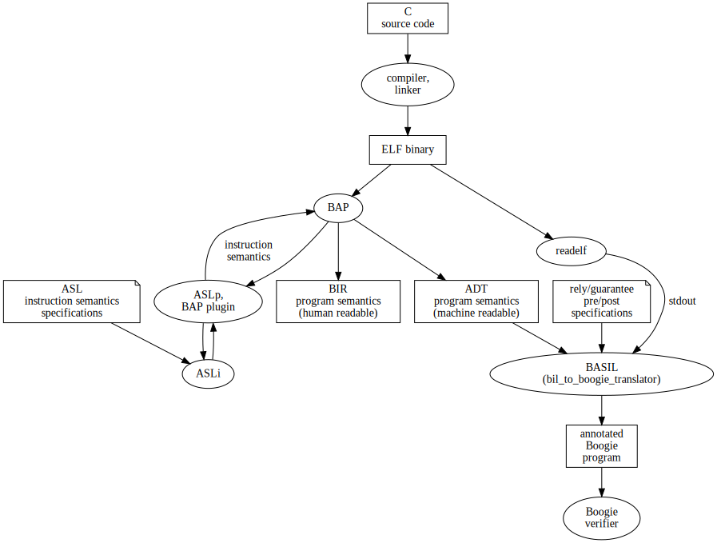

## Project Summary 

- [bil-to-boogie-translator](https://github.com/UQ-PAC/bil-to-boogie-translator) The "BASIL" project: translating lifted Aarch64 binaries to boogie annotated weakest pre-condition and rely/guarantee for information flow. 

- [bap](https://github.com/UQ-PAC/bap) Fork of CMU Binary Analysis Platform with the ASLp plugin _and_ primus lisp semantics. ASLp is used by default instead of the primus semantics.
    - The home of the previous project to provide Aarch64 semantics to bap manually using its Primus lisp plugin framework 
    - [barrier-tools](https://github.com/UQ-PAC/barrier-tools/blob/main/veri-asm.py) Tools used in writing the BAP Primus semantics. Contains some scripts useful for exploring BAP's lifter 
    - [qemu](https://github.com/UQ-PAC/qemu)
        - BAP QEMU fork instrumented to provide traces for comparing BAP generated semantics. Supports basic instructions with partial support for SIMD and FP instructions.
- [gtirb-semantics](https://github.com/UQ-PAC/gtirb-semantics) In-progress project to use the GTIRB lifter with instruction level semantics provided by ASLp, (to replace BAP)
- [wemelt](https://github.com/UQ-PAC/wemelt) An earlier information flow logic verifier for a source code language 

- ASL Lifter Project  (FMCAD 2023)
    - [aslp](https://github.com/UQ-PAC/aslp) The Architecture Specification Language interpreter (ASLi) partial evaluator (ASLp)
    - [bap-asli-plugin](https://github.com/UQ-PAC/bap-asli-plugin) BAP plugin for lifting aarch64, with instruction-level semantics provided by the ASL partial evaluator (ASLp)
    - [llvm-translator](https://github.com/UQ-PAC/llvm-translator) Tool for evaluating and comparing ASLp against existing lifters using Alive2 

- [wpif_csf2021](https://github.com/UQ-PAC/wpif_CSF21) Isabelle theories for _Backwards-directed information flow analysis for concurrent programs_ CSF'21 paper 
- [wmm-rg](https://github.com/UQ-PAC/wmm-rg) Isabelle theories for a  Rely/guarantee logic for weak memory models based on interfering thread-local instruction pairs

